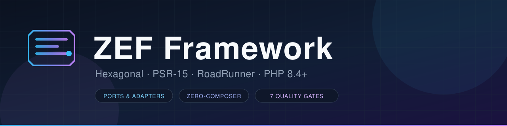

<div align="center">
  
</div>

<br>

<div align="center">

  
  
  
  <br>
  
  
  
  
  <br>
  
  

</div>

<br>

<div align="center">

  <a href="https://github.com/mbetixz/zef-framework/actions/workflows/ci.yml"></a>
  <a href="https://github.com/mbetixz/zef-framework/actions/workflows/php-sast.yml"></a>
  <a href="https://github.com/mbetixz/zef-framework/actions/workflows/github-code-scanning/codeql"></a>
  <a href="https://github.com/mbetixz/zef-framework/actions/workflows/secret-scan.yml"></a>
  <a href="https://github.com/mbetixz/zef-framework/actions/workflows/dependency-review.yml"></a>
  <br>
  <a href="https://github.com/mbetixz/zef-framework/actions/workflows/docs-check.yml"></a>
  <a href="https://github.com/mbetixz/zef-framework/actions/workflows/phpbench.yml"></a>
  <a href="https://github.com/mbetixz/zef-framework/actions/workflows/mutation.yml"></a>
  <a href="https://github.com/mbetixz/zef-framework/actions/workflows/sbom.yml"></a>
  <a href="https://github.com/mbetixz/zef-framework/actions/workflows/pages.yml"></a>

</div>

<p align="center">
  <b>Framework PHP 8.4 berarsitektur Hexagonal dengan worker persisten RoadRunner.</b>
</p>

<br>

##  Kenapa ZEF

Banyak framework PHP tumbuh dari kenyamanan. ZEF tumbuh dari pembongkaran: satu berkas raksasa 12.639 baris dipindahkan **verbatim** ke struktur multi-berkas, lalu dijaga ketat oleh gerbang otomatis.

<table width="100%">
  <tr>
    <td width="33%" valign="top">
      <h3 align="center">Batasan yang Diuji</h3>
      <p align="center">Arah dependensi antar-layer ditegakkan <code>deptrac</code> dengan <code>--fail-on-uncovered</code> — 0 violation. Arsitektur yang hanya ada di diagram tidak dihitung.</p>
    </td>
    <td width="33%" valign="top">
      <h3 align="center">Mutan, Bukan Baris</h3>
      <p align="center">Ukuran kualitasnya adalah <b>mutan yang benar-benar terbunuh</b>, bukan baris yang dieksekusi. Menambah test yang hanya menyentuh baris tanpa asersi tidak menaikkan skor.</p>
    </td>
    <td width="33%" valign="top">
      <h3 align="center">Tanpa Composer pun Jalan</h3>
      <p align="center">Classmap statis <code>autoload/zef_autoload.php</code> memuat seluruh kelas first-party. PHPUnit, Composer, dan jaringan bukan syarat untuk menjalankan self-test.</p>
    </td>
  </tr>
</table>

<br>

## Fitur Utama

<table width="100%">
  <tr>
    <th align="left">Area</th>
    <th align="left">Yang tersedia</th>
  </tr>
  <tr>
    <td><b>Container &amp; DI</b></td>
    <td>Autowiring rekursif (<code>#[Inject]</code>, <code>#[Value]</code>, <code>#[Target]</code>) · contextual binding · decoration chain · deferred provider · AOT compile ke berkas PHP murni</td>
  </tr>
  <tr>
    <td><b>HTTP &amp; Router</b></td>
    <td>Radix-tree router · route group/prefix bersarang · route cache terkompilasi · conditional GET (ETag/304) · RFC 9457 Problem Details · negosiasi versi API · middleware PSR-15</td>
  </tr>
  <tr>
    <td><b>CQRS</b></td>
    <td>Command bus &amp; query bus · handler terpisah dari transport · integrasi container</td>
  </tr>
  <tr>
    <td><b>OpenAPI Docs</b></td>
    <td>Spesifikasi <b>OpenAPI 3.1</b> otomatis dari route table + PHP 8.4 Attributes · endpoint <code>/openapi.json</code> (ETag/304) · Swagger UI dev-only · CLI <code>bin/zef openapi:generate</code> · export Postman v2.1 · serializer JSON/YAML dependency-free · validator struktural</td>
  </tr>
  <tr>
    <td><b>Configuration</b></td>
    <td><b>Config System v2</b>: multi-source (<code>config/*.php</code> + overlay env <code>ZEF_DATABASE__HOST</code> + secrets provider) · skema tervalidasi <i>fail-fast</i> yang melaporkan semua pelanggaran sekaligus · accessor bertipe <code>string()/int()/enum()</code> · export config terkompilasi untuk boot produksi</td>
  </tr>
  <tr>
    <td><b>Event Sourcing</b></td>
    <td>Port <code>EventStore</code> + adapter <code>InMemory</code>/<code>PDO</code> (persist atomik dalam transaction ambien) · <code>AggregateRoot</code> + kebijakan snapshot · <code>Projector</code> catch-up ber-checkpoint · transactional outbox + relay (retry eksponensial, dead letter)</td>
  </tr>
  <tr>
    <td><b>Database</b></td>
    <td>Query Builder + adapter PDO (savepoint transaction bersarang) · <code>Migrator</code> berversi dengan lock TTL · base <code>Repository</code></td>
  </tr>
  <tr>
    <td><b>Cache</b></td>
    <td>Cache bertag · tier L1/L2 · lock lease · store Redis &amp; APCu untuk deployment terdistribusi</td>
  </tr>
  <tr>
    <td><b>Jobs</b></td>
    <td>Scheduler cron &amp; fixed-interval · <code>CronExpression</code> · middleware dedup at-least-once</td>
  </tr>
  <tr>
    <td><b>Keamanan</b></td>
    <td>AES-256-GCM + rotasi key ring · TOTP (RFC 6238) &amp; Base32 · CSRF · origin policy · rate limiter (in-memory/Redis/APCu) · SecurityPolicy fail-closed</td>
  </tr>
  <tr>
    <td><b>Observability</b></td>
    <td>OpenTelemetry (tracer, span, propagator, meter) · health aggregator · endpoint Prometheus <code>/metrics</code></td>
  </tr>
  <tr>
    <td><b>Runtime</b></td>
    <td>Worker persisten RoadRunner v4.1 · <code>.rr.yaml</code> siap pakai · CLI <code>bin/zef</code> dengan 10 generator · REPL <code>tinker</code></td>
  </tr>
</table>

<details>
<summary><b>Riwayat rilis selengkapnya (v2.8.0 → v2.21.0)</b> — 25 catatan perubahan</summary>

<br>

Setiap rilis bersifat **aditif**: perilaku lama tidak diubah.

| Rilis | Fokus |
|:------|:------|
| **v2.8.0** | Tagged services · URL generator · ETag/304 · ProblemDetails · pagination · Prometheus · health aggregator · cache bertag · scheduler · AES-GCM · TOTP · validator |
| **v2.9.0** | Advanced Autowiring Engine: atribut, interface binding berlapis, variadic koleksi, graf dependensi, AOT compiler |
| **v2.10.0** | Enterprise Feature Pack: contextual binding, decoration, route cache, API versioning, sort/filter whitelist, key ring, i18n, form request, tinker, manifest K8s |
| **v2.11.0** | RadixTree Namespace Container |
| **v2.12.0–v2.13.1** | Penyelarasan toolchain Composer, hardening (PHPStan level *max* + strict-rules, PHPCS + Slevomat, Rector, Deptrac fail-on-uncovered), migrasi suite ke PHPUnit native |
| **v2.14.0–v2.14.9** | Kampanye mutation *deep-dive* per fase: Security, Container, Runtime lifecycle, HTTP/Router/Kernel, Observability, Domain inti, Infrastructure |
| **v2.15.0–v2.16.0** | Lanjutan ratchet mutasi & penutupan escape per zona |
| **v2.17.0** | Situs dokumentasi resmi diterbitkan ke GitHub Pages |
| **v2.18.0** | **Database Core**: Query Builder + PDO, Migrator, Repository base |
| **v2.19.0** | **Event Sourcing**: EventStore + adapter, AggregateRoot, Projector, transactional outbox |
| **v2.20.0** | **OpenAPI 3.1 Docs**: spesifikasi otomatis dari route table + Attributes, validator struktural, Swagger UI dev-only, CLI + export Postman |
| **v2.21.0** | **Configuration System v2**: multi-source + env overlay + secrets provider, skema fail-fast collect-all, accessor bertipe + native enum, config terkompilasi |
| **v2.21.1** | **Configuration hardening**: kueri pola radix (`query()/subtree()/longestMatch()`), decorator secrets tangguh (retry + backoff + stale fallback), hint penolakan string kosong, compiled config `chmod 0600` + header keamanan |

Rincian per rilis: [`docs/CHANGELOG-v2.21.1.md`](docs/CHANGELOG-v2.21.1.md), [`docs/CHANGELOG-v2.21.0.md`](docs/CHANGELOG-v2.21.0.md), [`docs/CHANGELOG-v2.20.0.md`](docs/CHANGELOG-v2.20.0.md), [`v2.19.0`](docs/CHANGELOG-v2.19.0.md), [`v2.18.0`](docs/CHANGELOG-v2.18.0.md), [`v2.17.0`](docs/CHANGELOG-v2.17.0.md), [`v2.16.0`](docs/CHANGELOG-v2.16.0.md), [`v2.15.0`](docs/CHANGELOG-v2.15.0.md), [`v2.14.0`](docs/CHANGELOG-v2.14.0.md) — atau seluruh 26 berkas di [`docs/`](docs/README.md).

</details>

<br>

## Persyaratan

| Komponen | Versi | Catatan |
|:---------|:------|:--------|
| **PHP** | `^8.4` | Diuji pada PHP 8.4.25 (NTS) |
| **RoadRunner** | `^4.1` | `spiral/roadrunner-http` + `nyholm/psr7`; binary <kbd>bin/rr</kbd> sudah disertakan |
| **Redis** | opsional | Rate limiter & cache terdistribusi (`ext-redis`) |
| **APCu** | opsional | Rate limiter instance tunggal (`ext-apcu`) |
| **Composer** | opsional | Framework berjalan tanpa Composer lewat classmap statis |

<br>

## Instalasi

### Opsi A — Tanpa Composer

Classmap statis memuat seluruh kelas first-party; self-test berjalan tanpa PHPUnit dan tanpa jaringan.

```bash
git clone https://github.com/mbetixz/zef-framework.git
cd zef-framework

php bin/zef --self-test          # 501 assertion, 19 suite
php bin/zef --self-test=v280     # hanya suite fitur v2.8.0
php bin/zef --self-test=router   # filter substring case-insensitive
```

### Opsi B — Dengan Composer <kbd>disarankan untuk pengembangan</kbd>

```bash
composer install

composer test            # suite PHPUnit native
composer coverage:gate   # coverage + ambang 90%
composer stan            # PHPStan level max + strict-rules
composer deptrac         # konformansi arsitektur hexagonal
composer lint            # php -l seluruh berkas first-party
composer mutation        # gerbang mutasi (MSI)
composer docs            # API reference Doctum → build/api
```

> Autoloader statis tetap terdaftar melalui `autoload.files` ketika Composer dipakai, sehingga keduanya aman berdampingan. Interface PSR resmi (`psr/*`) digunakan otomatis bila tersedia; jika tidak, shim kondisional di `src/Compat/Psr/` yang aktif.

<br>

## Quick Start

<div align="center">
  
  <br>
  <sub><b>Cuplikan quick start</b> — animasi terminal SVG di <code>docs/assets/quickstart.svg</code> (bukan rekaman asciinema; <code>asciinema</code> tidak tersedia di lingkungan build). Setiap baris keluaran disalin dari sesi nyata di repositori ini dengan <b>PHP 8.4.25</b>.</sub>
</div>

### 1. Menjalankan server

```bash
php bin/zef --serve 0.0.0.0:8080
# atau
php -S 0.0.0.0:8080 public/index.php
```

### 2. Worker persisten (produksi)

Bridge RoadRunner dan binary <kbd>bin/rr</kbd> sudah termasuk dalam paket — konfigurasi siap di `.rr.yaml`:

```bash
vendor/bin/rr serve      # worker: bin/worker.php
```

### 3. Memakai framework dari kode

```php
<?php

declare(strict_types=1);

require 'autoload/zef_autoload.php';

use Zef\App\Bootstrap;

$app = Bootstrap::createApp(debug: true);   // host tepercaya, provider Core/Toko/Health/Middleware
// jalankan melalui public/index.php atau worker RoadRunner
```

```php
<?php

declare(strict_types=1);

use Zef\Framework\Cache\InMemoryCache;
use Zef\Framework\Cache\InMemoryCacheStore;
use Zef\Framework\Cache\SystemCacheClock;
use Zef\Framework\Container\Autowiring\AutowireCompilerPass;

$cache = new InMemoryCache(new InMemoryCacheStore(), new SystemCacheClock());

$pass   = new AutowireCompilerPass(configValues: ['db.host' => 'localhost'], module: 'billing');
$result = $pass->process($container, [PaymentService::class]);
$container->validateAndFreeze();            // graf dependensi lengkap
```

<details>
<summary><b>Contoh lanjutan</b> — contextual binding, route group, decoration</summary>

<br>

```php
<?php

declare(strict_types=1);

$container->when(BillingService::class)->needs(PaymentGateway::class)->give('gateway.stripe');

$container->decorate(
    'mailer',
    static fn ($ctx, $inner) => new LoggingMailer($inner, $ctx->get('logger')),
);

$router->group(['prefix' => '/api/v2', 'name' => 'api.v2.'], static function ($router): void {
    $router->add('GET', '/users', 'user.index', name: 'users');
});
```

</details>

<br>

## Tabel Rute Bawaan

Aplikasi demo mengekspos rute berikut dari `modules/` dan `plugins/`:

| Rute | Handler | Sumber | Catatan |
|:-----|:--------|:-------|:--------|
| `GET /` | `HomeHandler` | `modules/Core` | — |
| `GET /about` | `AboutHandler` | `modules/Core` | — |
| `GET /health` | `AggregateHealthHandler` | `modules/Health` | agregat; 503 saat degraded |
| `GET /health/live` | `LiveHandler` | `modules/Health` | liveness |
| `GET /health/ready` | `ReadyHandler` | `modules/Health` | readiness |
| `GET /metrics` | `MetricsHandler` | `modules/Health` | format Prometheus |
| `GET /toko` | `TokoHandler` | `plugins/Toko` | plugin contoh |
| `GET /toko/produk/{id:int}` | `ProdukDetailHandler` | `plugins/Toko` | constraint `{id:int}` |

Respon `404`, `400` (pelanggaran constraint), dan `405` juga aktif.

<br>

## CLI — `bin/zef`

<table width="100%">
  <tr><th align="left">Perintah</th><th align="left">Kegunaan</th></tr>
  <tr><td><kbd>bin/zef list</kbd></td><td>Katalog seluruh command (mendukung <code>--json</code>)</td></tr>
  <tr><td><kbd>bin/zef --self-test</kbd></td><td>Menjalankan 501 assertion self-test</td></tr>
  <tr><td><kbd>bin/zef --serve 0.0.0.0:8080</kbd></td><td>Server HTTP pengembangan</td></tr>
  <tr><td><kbd>bin/zef route:list</kbd></td><td>Inspeksi rute beserta namanya</td></tr>
  <tr><td><kbd>bin/zef module:list</kbd></td><td>Modul terdaftar (hasil boot nyata)</td></tr>
  <tr><td><kbd>bin/zef plugin:list</kbd></td><td>Plugin yang ditemukan di disk</td></tr>
  <tr><td><kbd>bin/zef config:show &lt;key&gt;</kbd></td><td>Dump konfigurasi teragregasi (JSON-safe)</td></tr>
  <tr><td><kbd>bin/zef tinker</kbd></td><td>REPL dengan <code>$app</code> dan <code>$container</code> siap pakai</td></tr>
  <tr><td><kbd>bin/zef make:*</kbd></td><td>10 generator: <code>module</code>, <code>plugin</code>, <code>handler</code>, <code>middleware</code>, <code>config</code>, <code>command</code>, <code>query</code>, <code>entity</code>, <code>valueobject</code>, <code>service</code></td></tr>
</table>

```bash
bin/zef make:module katalog
bin/zef make:handler Produk --module=katalog --path=/katalog/produk
bin/zef make:command PlaceOrder --module=katalog
```

<br>

## Struktur Proyek

```text
zef-framework/
├── assets/readme-banner.svg     # aset README
├── autoload/zef_autoload.php    # classmap statis (fallback tanpa Composer)
├── bin/
│   ├── zef                      # CLI: list, --self-test, --serve, route:list, make:* , tinker
│   ├── worker.php               # worker RoadRunner
│   └── rr                       # binary RoadRunner
├── public/index.php             # entrypoint HTTP (web SAPI)
├── src/                         # 360 berkas PHP — inti framework
│   ├── Bootstrap.php
│   ├── Compat/Psr/              # 23 shim PSR kondisional
│   ├── Domain/                  # 181 — port, kontrak, value object, validator
│   ├── Application/             #  66 — mesin orkestrasi in-process (CQRS, jobs, observability)
│   ├── Infrastructure/          #  47 — adapter outbound: cache, redis, otlp, crypto, prometheus
│   ├── Adapters/                #  35 — adapter inbound: http, router, kernel, runtime
│   └── Middleware/              #   7 — middleware PSR-15
├── app/Bootstrap.php            # aplikasi demo (createApp + provider)
├── modules/                     # modul: Core, Health
├── plugins/                     # plugin contoh: Toko
├── tests/                       # 90 berkas PHP — suite PHPUnit native + self-test
├── benchmarks/ContainerBench.php
├── deploy/                      # Dockerfile · docker-compose.yml · k8s/
├── docs/                        # 25 CHANGELOG + panduan (lihat bagian Dokumentasi)
├── scripts/
│   ├── lint.php                 # lint seluruh berkas PHP
│   ├── build_docs.php           # Markdown → situs HTML statis
│   └── ci/                      # gate: coverage, phpstan-baseline, zone-coverage, abandoned-policy
└── .github/workflows/           # 13 workflow
```

<br>

## Keamanan Runtime

Runtime worker persisten berbeda mendasar dari PHP-FPM: proses hidup lama, sehingga **state lintas-request adalah risiko pertama**, bukan pengecualian.

<table width="100%">
  <tr><th align="left">Kontrol</th><th align="left">Perilaku</th></tr>
  <tr>
    <td><b>SecurityPolicy</b></td>
    <td>Bootstrap fail-closed: konfigurasi keamanan yang tidak lengkap menghentikan start, bukan menurunkan perlindungan secara diam-diam.</td>
  </tr>
  <tr>
    <td><b>Host tepercaya</b></td>
    <td><code>ZEF_TRUSTED_HOSTS</code> default <code>localhost,127.0.0.1,::1,zef.test</code>.</td>
  </tr>
  <tr>
    <td><b>CSRF</b></td>
    <td>Aktif bila <code>ZEF_SECURITY_CSRF_SECRET</code> (≥ 32 byte) diisi; nama cookie/header dan flag Secure/HttpOnly/SameSite dapat dikonfigurasi.</td>
  </tr>
  <tr>
    <td><b>Batas body</b></td>
    <td><code>ZEF_MAX_BODY_BYTES</code> → <code>413</code> saat terlampaui.</td>
  </tr>
  <tr>
    <td><b>Rate limit</b></td>
    <td>In-memory, Redis, atau APCu; mode terdistribusi dipilih lewat switch non-rahasia.</td>
  </tr>
  <tr>
    <td><b>SAST &amp; rahasia</b></td>
    <td>Semgrep (<code>php-sast.yml</code>), CodeQL, dan pemindaian rahasia (<code>gitleaks</code>) berjalan sebagai check wajib pada setiap PR.</td>
  </tr>
</table>

**Kebijakan pelaporan kerentanan** ada di [`SECURITY.md`](SECURITY.md).

<br>

## Variabel Lingkungan

| Variabel | Default | Keterangan |
|:---------|:--------|:-----------|
| `ZEF_ENV` | — | Penanda lingkungan aplikasi |
| `ZEF_DEBUG` | `0` | Mode debug (diagnostik verbose) |
| `ZEF_MAX_BODY_BYTES` | bawaan framework | Batas ukuran request body (`413` bila lebih) |
| `ZEF_TRUSTED_HOSTS` | `localhost,127.0.0.1,::1,zef.test` | Daftar host tepercaya (CSV) |
| `ZEF_SECURITY_CSRF_SECRET` | — | Secret CSRF ≥ 32 byte; mengaktifkan CSRF |
| `ZEF_SECURITY_CSRF_TOKEN_BYTES` · `_COOKIE` · `_HEADER` · `_SAMESITE` · `_SECURE` · `_HTTP_ONLY` | — | Penyetelan CSRF |
| `ZEF_SECURITY_ORIGIN_POLICY` · `ZEF_SECURITY_ALLOWED_ORIGINS` | — | Kontrol origin |
| `ZEF_SECURITY_RATE_LIMIT` · `_MAX` · `_WINDOW` · `_MAX_KEYS` · `_DISTRIBUTED_RATE_LIMIT` | — | Rate limiting |
| `ZEF_SECURITY_HSTS` · `ZEF_SECURITY_CSP` | — | Header keamanan respons |
| `ZEF_WORKER_MAX_JOBS` | `0` (tanpa batas) | Kapasitas job per worker sebelum daur ulang |
| `ZEF_WORKER_MEMORY_LIMIT` | `0` (nonaktif) | Batas memori worker (byte) |

> Seluruh switch `ZEF_SECURITY_*` adalah **selector non-rahasia**: nilainya dibaca dari lingkungan dan tidak pernah di-hardcode, dan secret (mis. `ZEF_SECURITY_CSRF_SECRET`) tidak boleh ditulis ke repositori, log, atau berkas konfigurasi yang dapat dibaca publik.

<br>

## Gerbang Kualitas

Sebuah perubahan tidak dianggap selesai sebelum **gerbang independen** hijau. "Test lulus" bukan bukti kualitas, dan "pipeline hijau" bukan bukti keamanan.

<table width="100%">
  <tr><th align="left">#</th><th align="left">Gerbang</th><th align="left">Perintah</th><th align="left">Ambang / bukti</th></tr>
  <tr><td>1</td><td>Syntax</td><td><kbd>composer lint</kbd></td><td><code>417</code> berkas first-party, 0 kegagalan</td></tr>
  <tr><td>2</td><td>Suite PHPUnit native</td><td><kbd>composer test</kbd></td><td><code>1498</code> test · <code>16861</code> assertion · 5 skipped</td></tr>
  <tr><td>3</td><td>Coverage</td><td><kbd>composer coverage:gate</kbd></td><td>ambang statement <b>90%</b> (diukur Xdebug)</td></tr>
  <tr><td>4</td><td>Mutation testing</td><td><kbd>composer mutation</kbd></td><td><code>--min-msi=85 --min-covered-msi=90</code></td></tr>
  <tr><td>5</td><td>Analisis statis</td><td><kbd>composer stan</kbd></td><td>PHPStan level <b>max</b> + strict-rules, baseline ter-ratchet</td></tr>
  <tr><td>6</td><td>Konformansi arsitektur</td><td><kbd>composer deptrac</kbd></td><td><code>--fail-on-uncovered</code>, 0 violation</td></tr>
  <tr><td>7</td><td>Gaya &amp; modernisasi</td><td><kbd>composer format:check &amp;&amp; composer phpcs &amp;&amp; composer rector:check</kbd></td><td>php-cs-fixer (PER-CS2.0 + Symfony) · PHPCS + Slevomat · Rector 8.4</td></tr>
</table>

```bash
composer lint            # Linted 417 PHP files — 0 failure(s).
composer test            # Tests: 1498, Assertions: 16861, Skipped: 5
php bin/zef --self-test  # PASSED: 501  FAILED: 0
```

<details>
<summary><b>Mengapa MSI, bukan sekadar coverage</b></summary>

<br>

**MSI** (*Mutation Score Indicator*) = mutan terdeteksi ÷ **seluruh** mutan yang dihasilkan. Mutan yang tidak tercakup test tetap dihitung, sehingga test yang hanya mengeksekusi baris tanpa meng-*assert* perilaku tidak bisa menaikkan skor.

| Metrik | Definisi |
|:-------|:---------|
| **MSI** | mutan terdeteksi ÷ seluruh mutan |
| **Covered MSI** | mutan terdeteksi ÷ mutan yang tercakup test |
| **Mutation Code Coverage** | mutan tercakup ÷ seluruh mutan — *reachability* test, bukan ketajaman asersi |

Kampanye mutasi dijalankan per **zona kanonik** (`scripts/f16_zones.tsv`, 27 zona) dengan `--filter`, sehingga setiap area punya angka MSI-nya sendiri. Ratchet per-zona berjalan di `ci.yml` pada setiap push/PR, sedangkan suite agregat dijalankan `mutation.yml` dan **dituntut** `release.yml` sebelum rilis dipublikasikan.

</details>

<br>

## CI/CD

13 workflow pada `.github/workflows/`. `main` dilindungi: 7 check wajib, PR wajib, dan aturan berlaku juga untuk admin.

| Workflow | Peran |
|:---------|:------|
| `ci.yml` | Lint, self-test, PHPStan, PHPCS, Deptrac, ratchet mutasi per-zona |
| `php-sast.yml` | Semgrep — termasuk ERROR floor atas `tests/`, `scripts/`, `tools/` |
| `mutation.yml` | Suite mutasi agregat (tag rilis & dispatch manual) |
| `secret-scan.yml` · `dependency-review.yml` | Pemindaian rahasia (gitleaks) & review dependensi |
| `docs-check.yml` · `pages.yml` | Pemeriksaan API docs & publikasi situs dokumentasi |
| `sbom.yml` · `release.yml` · `release-drafter.yml` | SBOM, penerbitan rilis, draf catatan rilis |
| `phpbench.yml` | Benchmark performa container |
| `auto-fix.yml` · `composer-lock.yml` | Perbaikan gaya otomatis & bootstrap lockfile (manual) |

<br>

## Dokumentasi

Situs dokumentasi diterbitkan otomatis ke GitHub Pages pada setiap push ke `main`, dan setiap berkas juga dapat dibaca langsung dari repositori.

| Dokumen | Isi |
|:--------|:----|
| [`docs/README.md`](docs/README.md) | Indeks dokumentasi |
| [`docs/INSTALLATION.md`](docs/INSTALLATION.md) | Persyaratan, Composer, RoadRunner, Docker/K8s, variabel lingkungan |
| [`docs/CLI.md`](docs/CLI.md) | Referensi lengkap `bin/zef` |
| [`docs/ARCHITECTURE.md`](docs/ARCHITECTURE.md) | Pembongkaran monolith, layer hexagonal, aturan arah dependensi |
| [`docs/QUALITY.md`](docs/QUALITY.md) | Gerbang kualitas, mutation testing per area, triage mutan ekuivalen |
| [`docs/DEPLOYMENT.md`](docs/DEPLOYMENT.md) | Worker persisten RoadRunner, state lintas-request, observabilitas |
| [`docs/GOVERNANCE.md`](docs/GOVERNANCE.md) | Kebijakan gerbang rilis &amp; ratchet |
| [`docs/ROADMAP.md`](docs/ROADMAP.md) | Rencana &amp; status fitur |
| [`docs/EDGE-CASE-MATRIX.md`](docs/EDGE-CASE-MATRIX.md) | Kurikulum uji edge-case per fase kampanye mutasi |
| [`docs/security/php-sast.md`](docs/security/php-sast.md) | Panduan SAST PHP |

```bash
composer docs                  # API reference Doctum → build/api
php scripts/build_docs.php     # situs dokumentasi → build/docs
```

<br>

## Kontribusi

1. **Branch dari `main`** dan gunakan nama deskriptif dengan prefix peran, mis. `fix/rate-limiter-window` atau `docs/installation-clarity`.
2. **Jalankan gerbang secara lokal sebelum membuka PR** — CI akan menuntut hal yang sama:
   ```bash
   composer lint && composer test && composer stan && composer deptrac && composer format:check
   ```
3. **Satu perubahan, satu tujuan.** Perubahan aditif lebih mudah ditinjau daripada yang mengubah perilaku lama.
4. **Sertakan bukti, bukan klaim.** Untuk perubahan gate atau keamanan, cantumkan keluaran perintah yang mendukung.
5. **Jangan pernah menuliskan rahasia** ke kode, konfigurasi, log, atau catatan PR. Gunakan variabel lingkungan dengan nama yang jelas.
6. **Untuk kerentanan keamanan**, jangan buka issue publik — ikuti [`SECURITY.md`](SECURITY.md).

<br>

## Lisensi

**MIT** — deklarasi pada [`composer.json`](composer.json) dan teks penuh pada [`LICENSE`](LICENSE).

<div align="center">
  <sub>Hak cipta © 2026 <b>mbetixz</b> · <a href="LICENSE">MIT License</a></sub>
</div>

<br>

<div align="center">
  <sub>
    Dibangun dengan <b>PHP 8.4</b> · <b>Hexagonal</b> · <b>RoadRunner</b><br>
    Dokumentasi terbit otomatis di setiap push ke <code>main</code>.
  </sub>
</div>
